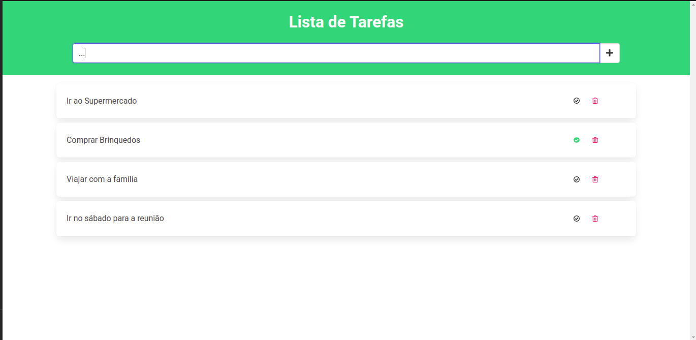

  

<h3 align="center">
    Todolist escrito com Angular
</h3>

  

  

  

### ✌ Olá!

Este projeto tem como intenção desenvolver um todolist afim de aprimorar conceitos e comprovar conhecimentos do Angular 12.

  

